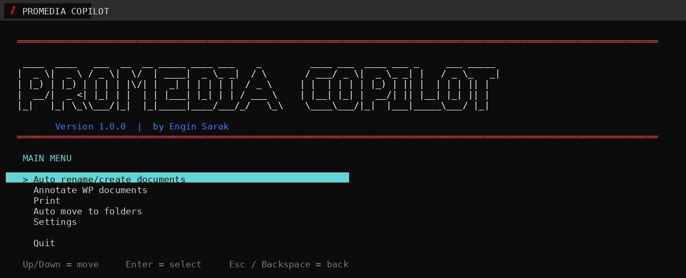
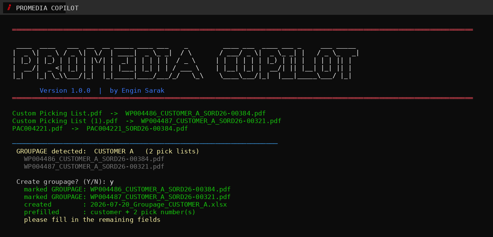
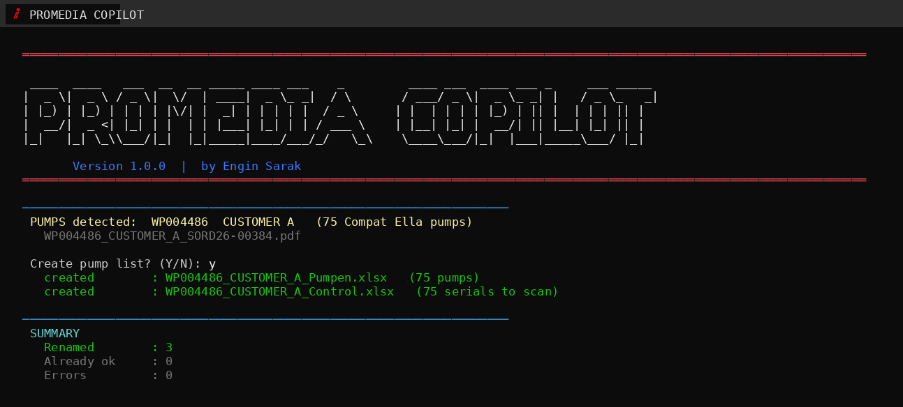
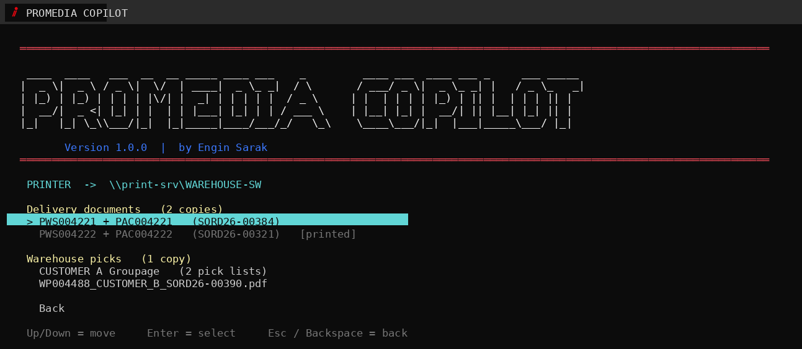
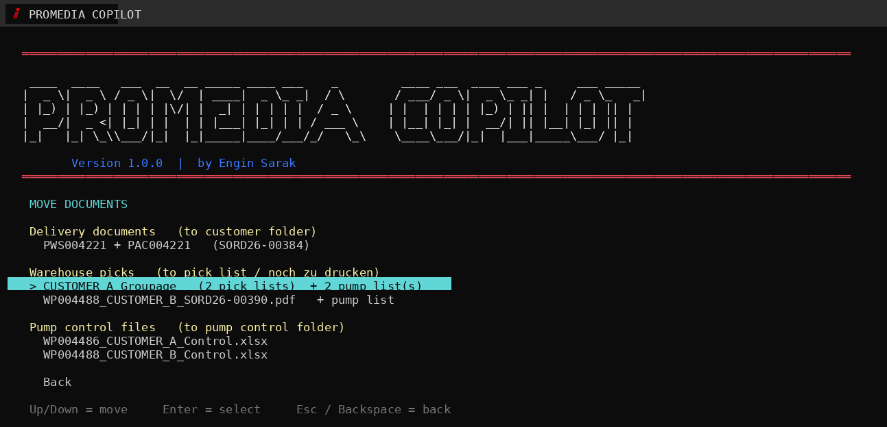
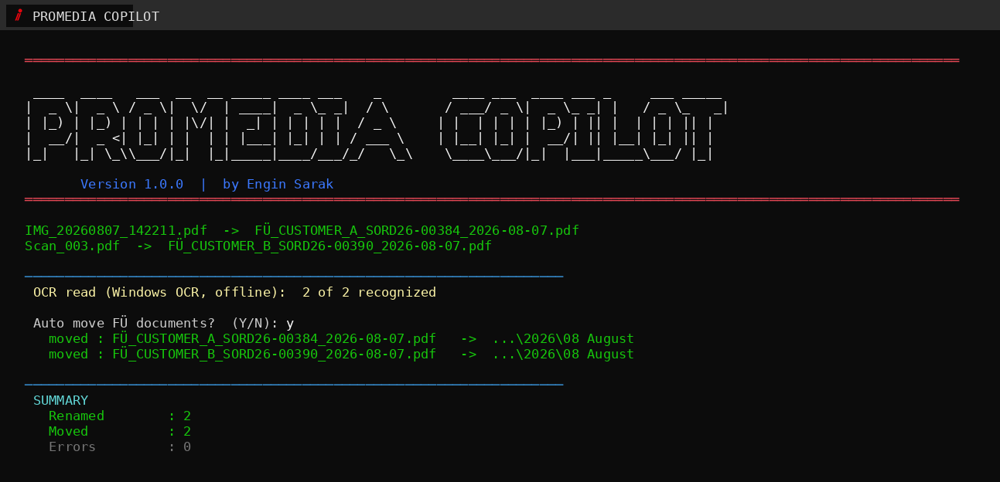
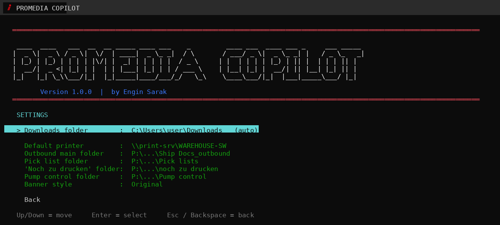

<div align="center">



**PROMEDIA COPILOT** · Version 1.0.0

*A PowerShell-based tool that automates renaming, printing, filing and Excel generation for warehouse pick lists and delivery notes*

*By [Engin Sarak](https://github.com/EnginSarak)*


</div>

---

## Table of Contents

- [How it works](#how-it-works)
- [Features](#features)
  - [Rename and create documents](#rename-and-create-documents)
  - [Pump picks](#pump-picks)
  - [Print](#print)
  - [Move to folders](#move-to-folders)
  - [Scanned documents (beta)](#scanned-documents-beta)
  - [Settings](#settings)
- [Install](#install)
- [Tech stack](#tech-stack)
- [Project structure](#project-structure)
- [Changelog](#changelog)

---

## How it works

Business Central exports pick lists as PDFs with generic names like `Custom Picking
List.pdf`. Getting them into the right filename, the right printer tray and the
right folder is the same handful of steps every time, and building the pump list and
scan sheet for a pump pick used to mean re-typing serial numbers by hand.

PROMEDIA COPILOT reads the PDFs directly and does all of that: renaming, stamping, printing,
filing, and generating the Excel sheets from data already sitting in the file. No line
list export, no copy-paste, no template hunting.

Single PowerShell script, no install beyond unzip, keyboard-driven menu, one COM call
into Excel where a formula can't do the job.

---

## Features

### Rename and create documents



Reads PAC / PWS / WP and the order number out of each PDF and renames it accordingly.
When two or more pick lists share a customer, it flags it as a groupage, stamps the
PDFs and builds the groupage sheet from the template with customer and pick numbers
already filled in.

### Pump picks



If a pick list contains pumps, it offers to build two files straight from
the PDF, no line list needed:

- `Pumpen.xlsx`: serial numbers grouped by bin, with counts and a total. Rows still
  sitting in the PICKING bin are excluded.
- `Control.xlsx`: the scan sheet for the warehouse floor. A scanned serial turns
  green, anything still red was missed.

### Print



Delivery documents and warehouse picks in one list. Matched PAC/PWS pairs print
together, deliveries twice, picks once. Anything already sent is marked so it doesn't
go out twice by accident.

### Move to folders



Each entry moves the full bundle: pick list with its pump list, groupage with its
sheet. Control files get their own section and go to the pump control folder, not the
print queue. Delivery documents are routed by reading the destination address, country
and date out of the PDF, including addresses drawn with an embedded font, and
suggesting the matching month folder; the customer, location and country found in the
document are shown so the target can be checked before filing. Deliveries going to the
same customer, location and country are grouped into one entry and moved together.
Plain year folders (e.g. `2026`) used only as an end-of-year archive are never treated
as a filing target; new month folders always go beside them, and when a month folder
doesn't exist yet, creating it is offered first.

### Scanned documents (beta)



Warehouse staff scan the signed delivery note after every pickup, and those scans land
in a folder with generic names. PROMEDIA COPILOT reads them with the OCR built into Windows,
no internet connection, no extra software, recognizes the delivery note, and renames
it the same way as the digital documents: `FÜ_<customer>_<order number>_<scan date>.pdf`.
A second entry, **Auto move FÜ documents**, then files the renamed scans into the same
customer/country folders as the regular delivery documents, using the destination
address read from the scan.

### Settings



Folders and printer are asked once and stored next to the script, including the Halle M
scan folder used by the scanned-documents feature. `reset.bat` clears all of it, run it
before handing the folder to someone else.

---

## Install

```
Code → Download ZIP → unpack → run "PROMEDIA COPILOT.bat"
```

First start asks for folders and printer once.

---

## Tech stack

| Layer | What |
| --- | --- |
| Runtime | PowerShell 5.1, Windows Console API |
| Spreadsheets | Excel COM interop |
| PDF parsing | Manual PDF stream inflate + text-token extraction, no external library |

---

## Project structure

```
PROMEDIA COPILOT/
├── PROMEDIA COPILOT.bat         starts the tool
├── _promedia_copilot.ps1        the program
├── reset.bat                   clears personal settings
├── update.txt                  version + file list for the updater
├── pumplist_template.xlsx      pump list template
├── pump_control_template.xlsx  scan control template
├── groupage_template.xlsx      groupage sheet template
└── docs/                       screenshots used above
```

`_promedia_copilot_settings.txt`, `_promedia_copilot_pairs.txt` and
`_promedia_copilot_printed.txt` are created at runtime and never leave the machine.

---

## Changelog

### 1.4.1

- Fixed the destination country and location being read wrong on FÜ documents.
  The address block could run into the product table, and `AXIUM's SO` was then
  taken as the country code `SO` (Somalia) with `AXIUM's` shown as the location.
  The block now stops at the table, and the country is taken from the code at
  the end of an address line instead of any two letters found anywhere.
- Fixed the `DE` of the Siegen pick-up address being used as the destination
  country when OCR put it on the same line as the delivery address.
- The location no longer carries the postcode: `2685 NZ Bleiswijk` now shows as
  `Bleiswijk`, `SI-1000 Ljubljana` as `Ljubljana`.
- Fixed "Open existing" from 1.4.0 offering a month folder from an unrelated
  customer or country, e.g. `Poland\August 2026` for a shipment to the
  Netherlands. The search now only looks inside year folders, which is the
  nesting it was meant to cover.

### 1.4.0

- Move to folders now looks inside the subfolders before offering to create a
  month folder. A folder like `August 2026` sitting inside a `2026` year folder
  used to stay invisible, so "Create folder" was suggested first even though the
  folder was already there.
- When such a folder is found it is offered at the top as
  `[ -> Open existing: 2026\August 2026 ]`, and "Create folder" moves down below
  "Move here". A month folder named just `August` counts too when it sits in a
  year folder for the right year.
- The search goes two levels deep, which keeps it quick on a network drive.

### 1.3.0

- FÜ scan now reads every page of a scan (up to 6) instead of only the first
  one, so a bundle holding several delivery notes gets all its order numbers
  in the file name: a scan with `SORD26-00321` and `SORD26-00384` is now named
  `FÜ_..._SORD26-00321_384_...` instead of dropping the second order.
- Only pages that are actually an AXIUM delivery note or packing list are
  counted for the order numbers, so references from an attached CMR or VGM
  page no longer end up in the name.
- Replaces the earlier workaround that only looked at later pages when the
  first page was unreadable; reading all pages covers that case too.

### 1.2.0

- The folder name is now a required field when filing: "New folder here (own
  name)" no longer cancels silently when you just press Enter, it asks again
  until a name is entered. Type `x` to cancel on purpose.
- Both folder name prompts now reject characters Windows does not allow in a
  folder name (`\ / : * ? " < > |`) instead of creating a broken or nested
  folder, and the "Create folder" prompt can be cancelled with `x` as well.

### 1.1.0

- The "'Noch zu drucken' folder" setting is now optional: setup completes
  without it, the settings screen shows "(optional)" when it is empty, and
  the folder is only offered as a move destination when it is actually set.
- FÜ scan now recognizes documents even when handwritten annotations on the
  Delivery Note page confuse the OCR: it automatically retries with the
  following pages (Packing List, CMR) before giving up.
- Move to folders now falls back to later words in the customer name
  (3rd, 4th, ...) when the first two don't match any existing folder, so
  customers like "Farouk Maamoun Tamer &Co" correctly land in a folder
  named after a later part of their name (e.g. "Tamer").

### 1.0.0

- Renamed the tool from DOC WIZARD to **PROMEDIA COPILOT**: new banner, new icon,
  new filenames throughout. Existing settings, remembered pairs and printed markers
  are carried over automatically on first run.
- Banner now redraws live when the console window is resized instead of leaving the
  terminal to reflow stale, oversized ASCII art, and falls back to a compact style
  when the window is too narrow for it.
- Banner artwork redrawn smaller and thinner, and the app icon now matches the
  actual PROMEDIA logo mark; the version line reads in blue.
- Transfer orders (`TRN-ORD-...`) are now recognized exactly like sales orders
  everywhere: renaming, groupage, move and print.
- Fixed addresses drawn with an embedded font (e.g. accented city names) not being
  read, which could leave the country undetected.
- Move to folders now routes by the destination address instead of the customer's
  billing address, when the two differ.
- Move to folders no longer creates or navigates into a plain year folder used as an
  end-of-year archive; new month folders always land beside it.
- The "Create folder" option is now offered first when the month folder for the
  shipment date doesn't exist yet.
- Fixed a slowdown in Print introduced by the embedded-font address reading.
- Annotate stamp text moved further left so it no longer runs off pick lists.
- Fixed a crash building the pump list on some pick lists.
- New (beta): **FÜ scan**: recognizes and renames scanned, signed delivery documents
  using the OCR built into Windows, no internet required.
- New (beta): **Auto move FÜ documents**: files the renamed scans the same way as the
  regular delivery documents.

---

*Customer names and numbers in the screenshots are made up.*
